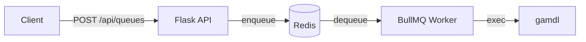

# Kanade

Apple Music download queue server powered by [gamdl](https://github.com/glomatico/gamdl) and [BullMQ](https://docs.bullmq.io/).

Accepts download requests via REST API, queues them in Redis, and processes them with a background worker.

## Architecture



## Quick Start

### Prerequisites

- Python 3.12+
- Redis
- gamdl dependencies: `N_m3u8DL-RE`, `mp4decrypt`, `MP4Box`, `amdecrypt`, `ffmpeg`

### Run locally

```bash
# Install dependencies
uv sync

# Start the server (API + worker)
python main.py serve
```

The API server starts on `http://localhost:5000`.

### Configuration

Place a `config.ini` in the project root for gamdl settings:

```ini
[gamdl]
cookies_path = ./cookies.txt
download_mode = nm3u8dlre
output_path = ./Apple Music
cover_format = jpg
cover_size = 1200
```

See [gamdl documentation](https://github.com/glomatico/gamdl) for all available options.

### Environment Variables

| Variable | Default | Description |
|---|---|---|
| `REDIS_HOST` | `redis` | Redis hostname |
| `REDIS_PORT` | `6379` | Redis port |
| `ENV` | — | Set to `production` to use gunicorn |

## API

Interactive API documentation is available at `/docs` (Scalar UI).

### `POST /api/queues`

Add an album to the download queue.

```bash
curl -X POST http://localhost:5000/api/queues \
  -H "Content-Type: application/json" \
  -d '{"album_id": 1869843536}'
```

**Request body:**

| Field | Type | Required | Description |
|---|---|---|---|
| `album_id` | `integer` | ✅ | Apple Music album ID |
| `options.overwrite` | `boolean` | — | Overwrite existing files (default: `false`) |

**Response:**

```json
{
  "id": "1",
  "name": "process",
  "data": { "url": "https://music.apple.com/jp/album/1869843536" },
  "timestamp": 1741430400000
}
```

### `GET /health`

Health check endpoint. Returns `{"status": "ok"}`.

### `GET /docs`

Scalar API documentation UI.

### `GET /openapi.json`

OpenAPI 3.1 specification.

## Docker

### Build

```bash
docker buildx build -t kanade .
```

### Run

```bash
docker run --rm -it \
  -e REDIS_HOST=redis \
  -v ./cookies.txt:/app/cookies.txt:ro \
  -v ./config.ini:/app/config.ini:ro \
  -p 5000:5000 \
  kanade serve
```

## Development

The dev container includes all native dependencies pre-built. Open the project in VS Code with the Dev Containers extension.

### Services (compose)

| Service | Port | Description |
|---|---|---|
| `app` | 5555 → 5000 | Kanade API + worker |
| `dashboard` | 13000 → 3000 | Bull Board (queue dashboard) |
| `redis` | 6379 | Redis |
| `wrapper` | — | Auth wrapper |

### VS Code Tasks

| Task | Description |
|---|---|
| `docker: build` | Build multi-arch Docker image |
| `docker: push` | Push image to registry |
| `version: bump` | Bump version in `pyproject.toml` |
| `release: deploy` | Bump → build → push |
